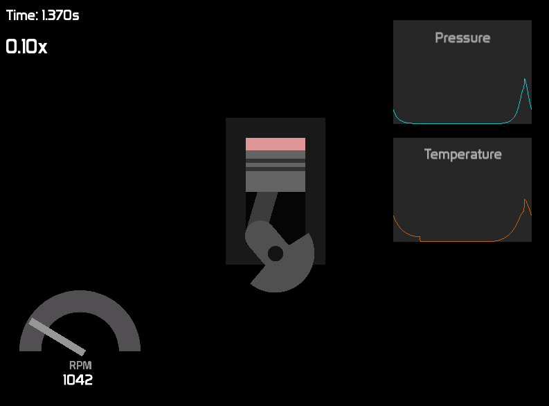

# Engine Simulation

Internal combustion engine simulator written in C++

## Showcase

## Dependencies
* `SFML2`
* `opencv2`

## Compiling

### Linux

Run `make` to build the project and `./main.out` to run it.

## Demo

The demo (`main.out`) supports the following optional arguments:

* `-engine [0/1]` - engine type, 0 = Yamaha RX100, 1 = Honda K20
* `-render [0/1]` - save video to `render/` folder or not

Start the engine by increasing the throttle (mouse wheel) and engaging the starter motor (s key).